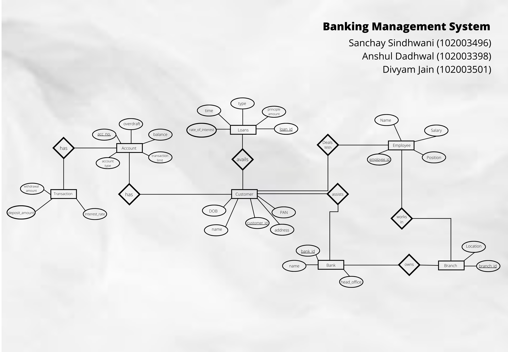

# 🏦 Bank-Database-Management-System

## Introduction

  
  

A bank is a financial institution which accepts deposits, pays interest on pre-defined rates, clears checks, makes loans, and often acts as an intermediary in financial transactions. It also provides other financial services to its customers. Bank management governs various concerns associated with bank in order to maximize profits. The concerns broadly include liquidity management, asset management, liability management and capital management.

## Entity-Relation (ER) Diagram

## Entity-Relation (ER) Table

